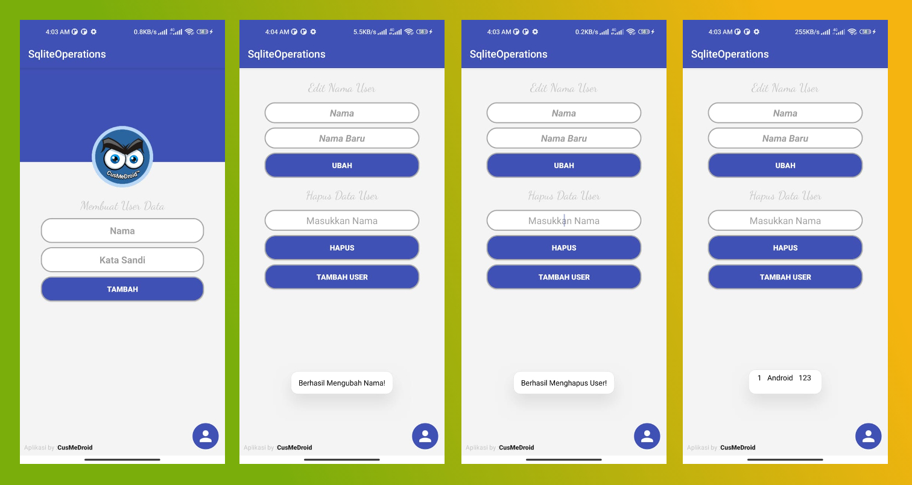

<hed>
  <meta charset="UTF-8">
  <link rel="icon" type="image/x-icon" href="icon/logo.png">
  <meta name="viewport" content="width=device-width, initial-scale=1">
  <meta name="description" content="Cusmedroid is an android studio application development project name. the name was created by iyortml alias suryo dwijayanto. Initially cusmedroid was a custom rom project on android, at that time in 2014 - 2015 cusmedroid was still looking for identity, until now in 2022 - then cusmedroid will be the unique name of me who doesn’t have a team.">
  <meta name="keywords" content="cusmedroid, iyortml, learn php with cusmedroid, learn php with iyortml, cusmedroid android, cusmedroid developer, developer indonesia, made in indonesia, website, php, html, css, js, xml, java, api, apikey, mysqli, phpmyadmin">
  <meta name="author" content="CusMeDroid">
</head>

# Welcome To CusMeDroid Source
This source code and apk building on android studio powered by cusmedroid

## Profile (Simple)

### Clone Repo
>cd `AndroidStudioProjects` //Your Directory

>git clone `https://github.com/CusMeDroid/android-studio/tree/main/Profile`

## SQLite (Simple)

### Clone Repo
>cd `AndroidStudioProjects` //Your Directory

>git clone `https://github.com/CusMeDroid/android-studio/tree/main/SqliteOperation`
